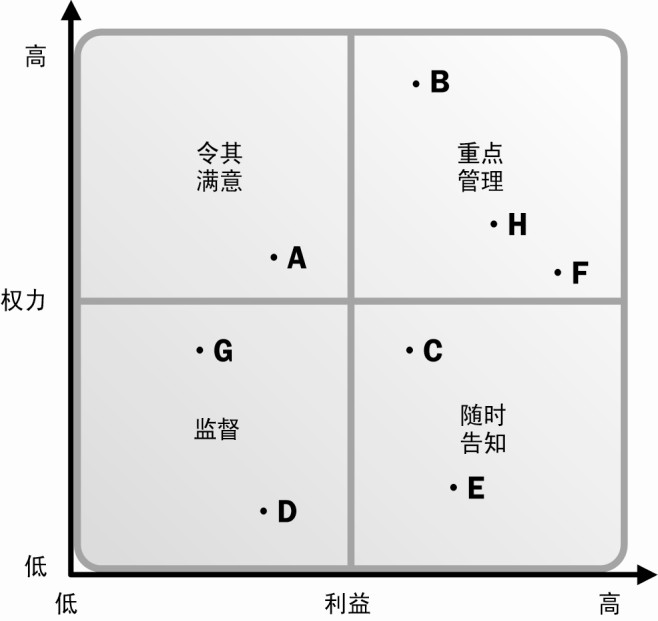

# 第13章项目干系人管理
干系人管理还关注与干系人的持续沟通，以便了解干系人的需要和期望，解决实际发生的问题，管理利益冲突，促进干系人合理参与项目决策和活动。

## 13.1识别干系人
在项目或阶段的早期就识别干系人，并分析他们的利益层次、个人期望、重要性和影响力，对项目成功非常重要。

### 13.1.2识别干系人：工具与技术
#### 13.1.2.1干系人分析
干系人分析是系统地收集和分析各种定量与定性信息，以便确定在整个项目中应该考虑哪些人的利益。通过干系人分析，识别出干系人的利益、期望和影响，并把他们与项目的目的联系起来。

干系人分析通常应遵循以下步骤：

- *识别全部潜在项目干系人及其相关信息*，如他们的角色、部门、利益、知识、期望和影响力。关键干系人通常很容易识别，包括所有受项目结果影响的决策者或管理者，如项目发起人、项目经理和主要客户。*通常可对已识别的干系人进行访谈，来识别其他干系人*，扩充干系人名单，直至列出全部潜在干系人。
-* 分析每个干系人可能的影响或支持，并把他们分类，以便制定管理策略*。在干系人很多的情况下，就必须对干系人进行排序，以便有效分配精力，来了解和管理干系人的期望。
- *评估关键干系人对不同情况可能做出的反应或应对，以便策划如何对他们施加影响，提高他们的支持，减轻他们的潜在负面影响。*
有多种分类模型可用于干系人分析，如：
- 权力/利益方格。根据干系人的职权（权力）大小及对项目结果的关注（利益）程度进行分类
- 权力/影响方格。根据干系人的职权（权力）大小及主动参与（影响）项目的程度进行分类。
- 影响/作用方格。根据干系人主动参与（影响）项目的程度及改变项目计划或执行的能力（作用）进行分类。
- 凸显模型。根据干系人的权力（施加自己意愿的能力）、紧急程度（需要立即关注）和合法性（有权参与），对干系人进行分类。

**图13-4干系人权力/利益方格示例**

### 13.1.3识别干系人：输出
#### 13.1.3.1干系人登记册
应定期查看并更新干系人登记册，因为在整个项目生命周期中干系人可能发生变化，也可能识别出新的干系人。

**注意：干系人发生变化，首先更新干系人登记册**

## 13.2规划干系人管理
规划干系人管理过程帮助项目经理制定不同方法，来有效调动干系人参与项目，管理干系人的期望，从而最终实现项目目标。

规划干系人管理是一个反复的过程，应由项目经理定期开展。

### 13.2.3规划干系人管理：输出
#### 13.2.3.1干系人管理计划
干系人管理计划是项目管理计划（见4.2.3.1节）的组成部分，为有效调动干系人参与而规定所需的管理策略。根据项目的需要，干系人管理计划可以是正式或非正式的，非常详细或高度概括的。

项目经理应该意识到干系人管理计划的敏感性，并采取恰当的预防措施。

## 13.3管理干系人参与
管理干系人参与是在整个项目生命周期中，与干系人进行沟通和协作，以满足其需要与期望，解决实际出现的问题，并促进干系人合理参与项目活动的过程。本过程的主要作用是，帮助项目经理提升来自干系人的支持，并把干系人的抵制降到最低，从而显著提高项目成功的机会。

通过管理干系人参与，确保干系人清晰地理解项目目的、目标、收益和风险，提高项目成功的概率。

干系人对项目的影响能力通常在项目启动阶段最大，而后随着项目的进展逐渐降低。项目经理负责调动各干系人参与项目，并对他们进行管理，必要时可以寻求项目发起人的帮助。主动管理干系人参与可以降低项目不能实现其目的和目标的风险。

### 13.3.1管理干系人参与：输入
#### 13.3.1.3变更日志
变更日志用于记录项目期间发生的变更。应该与适当的干系人就这些变更及其对项目时间、成本和风险等的影响进行沟通。

### 13.3.3管理干系人参与：输出
#### 13.3.3.1问题日志
在管理干系人参与过程中，可以编制问题日志。问题日志应随新问题的出现和老问题的解决而动态更新。

#### 13.3.3.3项目管理计划更新
有些沟通可能不再必要，可能需要替换无效的沟通方法，或者可能识别出了新的沟通需求。该计划也需要因处理关注点和解决问题而更新。

## 13.4控制干系人参与
在干系人管理计划中列出干系人参与活动，并在项目生命周期中加以执行。应该对干系人参与进行持续控制。

#### 项目文件更新
可能需要更新的项目文件包括（但不限于）：

- 干系人登记册。干系人登记册因下列情况而更新：干系人信息变化、识别出新干系人、原有干系人不再参与项目、原有干系人不再受项目影响，或者特定干系人的其他情况变化。
- 问题日志。随新问题的出现和老问题的解决而更新。

#### 13.4.3.5组织过程资产更新
可能需要更新的组织过程资产包括（但不限于）：

- 给干系人的通知。可向干系人提供有关已解决的问题、已批准的变更和项目总体状态的信息。
- 项目报告。采用正式和非正式的项目报告来描述项目状态。项目报告包括经验教训总结、问题日志、项目收尾报告和出自其他知识领域（见第4章至第12章）的相关报告。
- 项目演示资料。项目团队正式或非正式地向任一或全部干系人提供的信息。
- 项目记录。包括往来函件、备忘录、会议纪要及描述项目情况的其他文件。
- 干系人的反馈意见。可以分发干系人对项目工作的意见，用于调整或提高项目的未来绩效。
- 经验教训文档。包括对问题的根本原因分析、选择特定纠正措施的理由，以及有关干系人管理的其他经验教训。应该记录和发布经验教训，并在本项目和执行组织的历史数据库中收录。

## 附录X3人际关系技能
项目经理通过项目团队和其他干系人来完成工作。有效的项目经理应在技术、人际关系和概念技能等方面维持均衡，以便正确分析形势并合理应对。本附录将描述一些重要的人际关系技能，包括：

- 领导力；
- 团队建设；
- 激励；
- 沟通；
- 影响力；
- 决策；
- 政治和文化意识；
- 谈判；
- 建立信任；
- 冲突管理；
- 教练技术。

虽然项目经理还要用到其他人际关系技能，但合理使用上述技能有助于项目经理高效地管理项目。
## X3.1领导力
领导力是指有能力让一个群体为了一个共同的目标而努力，并像一个团队那样去工作。一般地讲，领导力是指通过他人来完成工作的能力。尊重和信任，而非畏惧和顺从，是有效领导力的关键要素。尽管在项目的每个阶段都需要有效的领导力，但在项目的开始阶段特别需要，因为这个阶段的工作重点是与项目参与者沟通愿景，并激励和鼓舞他们取得优秀业绩。
在整个项目中，项目团队的领导者要负责建立和维持愿景、战略与沟通，培育信任和开展团队建设，影响、指导和监督团队工作，以及评估团队和项目的绩效。
## X3.2团队建设
团队建设是指帮助一组人围绕共同的目标，彼此之间以及与领导、外部干系人和组织之间协同工作。卓越的领导力和团队建设将形成团队协作。
团队建设活动包括任务（建立目标、定义和协商角色、职责与程序）和过程（为加强沟通、管理冲突、激励和领导而进行的人际关系行为）。要创建良好的团队环境，就需要处理项目团队的问题，并把其作为团队的事情去讨论，而不是指责个人。还可以通过以下做法进一步强化团队建设：获取高级管理层的支持，鼓励团队成员的责任感，引入适当的奖赏、认可和道德规范，建立团队归属感，有效管理冲突，促进团队成员之间的信任和开放式沟通，以及提供有效的领导等。
团队建设在项目前期至关重要，并应该在整个项目期间持续进行。项目环境的变化不可避免。为有效地管理这些变化，需要持续进行团队建设或在团队建设中融入新内容。有效的团队建设将带来互相信任、高质量的信息交流、更好的决策及有效的项目管理。
## X3.3激励
项目团队由具有不同背景、期望和个人目标的团队成员组成。项目的全面成功依赖项目团队的责任感，而这又与他们的激励程度直接相关。
项目环境中的激励，需要建立一种氛围，保证既实现项目目标，又针对个人最看重的方面，使团队成员得到最大限度的满足。这些方面包括工作满意度、工作挑战性、成就感、成功与成长、充分的经济回报及成员认为必要和重要的其他奖赏与认可。
## X3.4沟通
沟通一直被认为是决定项目成败的最重要原因之一。项目团队内部及项目经理、团队成员与外部干系人之间的有效沟通至关重要。开诚布公地沟通，是达到团队协作和优秀绩效的有效途径。它可以改进项目团队成员之间的关系，建立相互信任。

为实现有效沟通，项目经理应了解其他人的沟通风格、文化差异／规范、关系、个性及整个情境等。对这些因素的了解可促进相互理解，进而实现有效沟通。项目经理应识别各种沟通渠道，了解自己需要提供哪些信息、接收哪些信息，以及使用哪些人际关系技能来与诸多项目干系人进行有效沟通。应该通过团队建设活动来了解团队成员的沟通风格（如直接的、合作的、逻辑性的、探索性的，等等），以便项目经理在规划沟通时合理考虑关系和文化差异。

倾听是沟通的一个重要部分。倾听技术（包括主动和被动）有助于洞察问题所在、谈判与冲突管理策略、决策方法和问题解决方法。
## X3.5影响力
影响力是通过分享权力和使用人际关系技能，使他人为了共同目标而相互合作。可根据以下原则来影响团队成员：

- 以身作则，始终表现出责任感；
- 使决策过程透明；
- 灵活使用人际关系技能，根据受众适时调整。要巧妙并慎重地运用权力，重视长期协作。

## X3.6决策
项目经理常用的4种决策方式是：命令、咨询、协商和抛硬币（随机）。影响决策方式的主要因素有4个，即时间限制、信任程度、质量和接受程度。项目经理可单独决策，也可允许项目团队参与决策过程。项目经理和项目团队有时会使用决策模型或过程，如以下所示六阶段模型：

- 问题定义。充分探究、澄清和定义问题；
- 问题解决方案生成。通过头脑风暴延长创意过程，避免过早决策，以便得到多个解决方案；
- 从创意到行动。确定评价标准，权衡备选方案的优缺点，选择最佳方案；
- 方案行动规划。获取关键参与者对方案的认可及承诺，使方案能发挥作用；
- 方案评估规划。进行事后分析与评价，总结经验教训；
- 对结果和过程的评估。评估问题解决的彻底程度或项目目标的达成情况（是前一阶段的延伸）。
## X3.7政治和文化意识
在项目环境里，由于项目所涉及的人员往往拥有不同的行为规范、背景和期望，组织中的政治问题是无法避免的。巧妙地运用政治和权力有助于项目经理获得成功。反之，如果忽略或回避项目中的政治问题，并且不恰当地运用权力，则会使项目的管理工作陷入困境。

今天，项目经理身处全球化的环境，很多项目都存在于文化多样性的环境中。理解并利用文化差异，项目管理团队更有可能创建一个互相信任和共赢的氛围。文化差异可以同时表现在个人或集体层面上，并且可同时涉及内部和外部的干系人。管理文化多样性的一个有效途径是，了解不同的团队成员，并编制良好的沟通计划（作为整体项目计划的一个部分）。

行为层面的文化是指那些独立于地理位置、民族传统或所讲语言（通用语言或多种语言）的行为和期望。文化能影响工作速度、决策过程及未经充分规划就采取行动的冲动。在某些组织中，文化可能引发冲突，形成压力，进而影响项目经理和项目团队的绩效。

## X3.8谈判
谈判是指与利益相同或相反的人进行会谈以期达成妥协或协议。谈判是项目管理中的一项主要工作，如果做得好就可以提高项目成功的概率。
以下技巧和做法有助于谈判成功：

- 分析形势；
- 区分自己的想要与需要，也要区分对方的想要与需要；
- 关注利益和问题，而非立场；
- 索取多、给予少，但要符合实际；
- 当你做出让步时，要表现得好像你在让出某些有价值的东西，而不是简单放弃；
- 一定要让双方都感觉自己赢了。双赢是最好的谈判风格，但并非总能实现。如果可能，不要让对方在离开时觉得自己被占了便宜；
- 认真倾听，清晰沟通。
## X3.9建立信任
在整个项目团队和其他关键干系人之间建立信任的能力，是高效团队领导力的关键组成部分。信任关系到合作、信息共享以及问题的有效解决。没有信任，就很难在参与项目的各干系人之间建立必要的良好关系。信任一旦被破坏，关系就会恶化、人员就会松散、合作就变得更加困难，甚至根本不可能。
以下措施可以帮助项目经理建立信任：

- 采用开放式的、直接的沟通来解决问题；
- 知会所有干系人，尤其是在所履行的承诺存在风险时；
- 花时间与团队直接沟通，询问非假设性问题，充分了解影响团队的情形；
- 直接、清晰地表达自己的需要或期望；
- 不要由于担心出错而隐瞒信息，而要乐于分享信息，即使你可能是错的；
- 接受创新，用直率的方式讨论问题或担忧；
- 超越自身利益看问题；
- 真正关心他人，避免让人觉得你的做法会损害他人利益。

## X3.10冲突管理
冲突在项目环境中不可避免。不一致的需求、对资源的竞争、沟通不畅以及其他诸多因素都可能成为冲突的起源。在项目环境中，冲突可能导致项目产生不良结果。但是，如果主动管理，冲突可以帮助团队找到更好的解决方案。项目经理必须能够找到冲突的原因，然后积极地管理冲突，从而最大程度地降低潜在的负面影响。在此基础上，项目团队才能交付更好的方案，从而提高项目成功的概率。

项目经理需要培养技能、积累经验，以便能够根据情形有效地调整自己的冲突管理风格。在项目环境下管理冲突，就需要在所有参与方之间建立基本信任，各方开诚布公地寻求解决冲突的积极方案。为了彻底解决问题，项目经理应该努力促进团队成员采用合作的方法。如果确实无法采用合作的方法，项目经理应该转而采用其他的主动管理方法来处理冲突，例如果断、包容、规避或妥协的方法。

管理冲突是项目经理所面对的重大挑战之一。为了带领团队成功应对冲突，项目经理需要动用其他所有的人际关系技能。

## X3.11教练技术
教练技术可以把项目团队的能力和绩效提升到更高的水平。教练技术通过授权和开发，帮助成员认识到自己的潜在能力。使用教练技术，可以帮助团队成员提升现有技能，也可以帮助他们掌握为保证项目成功所必需的新技能。教练技术有多种形式和方法。有时候，可以开展正式或非正式的培训，来提升技术能力或加强团队建设，并促进持续的人际互动。

面对绩效差的情况，也可以使用教练技术，帮助团队成员克服技能缺陷。教练不同于心理辅导。心理辅导关注的是团队成员“不愿做”的情形，而不是“不会做”的情形。如果团队成员由于缺乏技能、知识或经验，而没有实现或满足期望，那么就可以采用教练技术来帮助团队成员提升技能，使他们从“不会做”转化为“会做”。

教练技术是团队中的重要激励手段。随着团队成员技能、能力和自信的提升，他们就更愿意承担具有挑战性或要求严格的任务，团队会因此变得更高效。