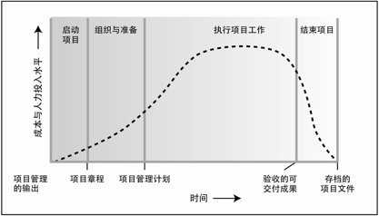

## 第2章组织影响和项目生命周期

### 2.1组织对项目管理的影响

#### 2.1.1组织文化与风格

文化和风格是经过长期积淀而形成的群体现象，被称为“文化规范”

组织文化是一种事业环境因素

项目经理应该知道谁是组织中的决策者或影响者

在全球化的大环境下，对于那些涉及多个组织、分布在全球不同地理位置的项目而言，了解文化对项目的影响更为重要。文化已成为决定项目成功的关键因素，多元文化能力已成为项目经理的重要能力。

**表2-1组织结构对项目的影响**
#### 2.1.3组织结构

根据职能经理和项目经理之间的权力和影响力的相对程度，矩阵型组织可分为弱矩阵、平衡矩阵和强矩阵。弱矩阵型组织保留了职能型组织的大部分特征，其项目经理的角色更像协调员或联络员。

平衡矩阵型组织虽然承认全职项目经理的必要性，但并未授权其全权管理项目和项目资金。

在项目型组织中，团队成员通常集中办公，组织的大部分资源都用于项目工作，项目经理拥有很大的自主性和职权。这种组织中也经常采用虚拟协同技术来获得集中办公的效果。

### 2.1.4组织过程资产

#### 2.1.4.1流程与程序

组织用于执行项目工作的流程与程序，包括（但不限于）：

- 启动和规划
	- 指南和标准，用于裁剪组织标准流程和程序以满足项目的特定要求；
	- *特定的组织标准，例如政策（如人力资源政策、健康与安全政策、职业道德政策、项目管理政策）*、产品和项目生命周期、质量政策与程序（如过程审计、改进目标、核对单、组织内使用的标准化的过程定义）；
	- 模板（如风险登记册、工作分解结构、项目进度网络图及合同模板）。
- 执行和监控
	- *变更控制程序*，包括修改组织标准、政策、计划和程序（或任何项目文件）所须遵循的步骤，以及如何批准和确认变更；
	- *财务控制程序*（如定期报告、必需的费用与支付审查、会计编码及标准合同条款）；
	- *问题与缺陷管理程序*，包括对问题与缺陷的控制、识别与处理，以及对行动方案的跟踪；
	- 组织对沟通的要求（如可用的沟通技术、许可的沟通媒介、记录保存政策及安全要求）；
	- 确定工作优先顺序、批准工作与签发工作授权的程序；
	- 风险控制程序，包括风险分类、风险描述模板、概率和影响定义，以及概率和影响矩阵；
	- 标准化的指南、工作指示、建议书评价准则和绩效测量准则。
- 收尾
	- 项目收尾指南或要求（如经验教训、项目终期审计、项目评价、产品确认和验收标准）。

	
#### 2.1.4.2共享知识库


组织用来存取信息的知识库，包括（但不限于）：


- 配置管理知识库，包括执行组织的所有标准、政策、程序和任何项目文件的各种版本与基准；
- 财务数据库，包括人工时、实际成本、预算和成本超支等方面的信息；
- *历史信息与经验教训知识库*（如项目记录与文件、完整的项目收尾信息与文件、关于以往项目选择决策的结果及以往项目绩效的信息，以及从风险管理活动中获取的信息）；
- 问题与缺陷管理数据库，包括问题与缺陷的状态、控制信息、解决方案以及相关行动的结果；
- 过程测量数据库，用来收集与提供过程和产品的测量数据；
- 以往项目的项目档案（如范围、成本、进度与绩效测量基准，项目日历，项目进度网络图，风险登记册，风险应对计划和风险影响评价）。


#### 2.1.5事业环境因素


*事业环境因素是指项目团队不能控制的，将对项目产生影响、限制或指令作用的各种条件。*事业环境因素是大多数规划过程的输入，可能提高或限制项目管理的灵活性，并可能对项目结果产生积极或消极的影响。从性质或类型上讲，事业环境因素是多种多样的。事业环境因素包括（但不限于）：


- *组织文化、结构和治理；*
- 设施和资源的地理分布；
- *政府或行业标准*（如监管机构条例、行为准则、产品标准、质量标准和工艺标准）；
- 基础设施（如现有的设施和固定资产）；
- *现有人力资源状况*（如人员在设计、开发、法律、合同和采购等方面的技能、素养与知识）；
- 人事管理制度（如人员招聘和留用指南、员工绩效评价与培训记录、奖励与加班政策，以及考勤制度）；
- *公司的工作授权系统；*
- 市场条件；
- 干系人风险承受力；
- *政治氛围；*
- *组织已有的沟通渠道；*
- *商业数据库*（如标准化的成本估算数据、行业风险研究资料和风险数据库）；
- 项目管理信息系统（如自动化工具，包括进度计划软件、配置管理系统、信息收集与发布系统或进入其他在线自动系统的网络界面）。

### 2.2项目干系人与治理


#### 2.2.1项目干系人

干系人包括所有项目团队成员，以及组织内部或外部与项目有利益关系的实体。

在整个项目生命周期中，识别干系人是一个持续的过程。
例如，未及时将法律部门列为重要干系人，最终导致工期延误、费用增加，因为在项目完成或产品交付之前才发现必须满足某些法律方面的要求。

忽视消极干系人的利益，会提高项目失败、延误或出现其他不利结果的可能性。

项目经理的重要职责之一就是管理干系人的期望。

项目经理的另一项职责就是平衡干系人的不同利益

**以下是项目干系人的一些例子：**

- 发起人。*发起人始终领导着项目，直到项目正式批准。发起人对制定项目初步范围与章程也起着重要的作用。对于那些超出项目经理控制范围的事项，将向上汇报给发起人。*
- 客户和用户
- 卖方
- 业务伙伴
- 组织内的团体
- 职能经理
- 其他干系人

### 2.3项目团队

项目团队包括项目经理，以及为实现项目目标而一起工作的一群人。项目团队包括项目经理、项目管理人员，以及其他执行项目工作但不一定参与项目管理的团队成员。

项目团队中的角色有：

- *项目管理人员。*
- *项目人员。*
- 支持专家。
- 用户或客户代表。
- 卖方。
- 业务伙伴成员。
- 业务伙伴。

#### 2.3.1项目团队的组成

领导虚拟团队的项目经理需要适应文化、工作时间、时区、当地条件和语言等方面的差异。

#### 2.4.1项目生命周期的特征


**图2-8通用项目生命周期结构中典型的成本与人力投入水平**

通用的生命周期结构具有以下特征：

- 成本与人力投入在开始时较低，在工作执行期间达到最高，并在项目快要结束时迅速回落。
- 图2-8中成本和人力投入的典型走势可能并不适用于所有项目。有的项目在生命周期早期支出较大，以确保所需资源到位，例如，在生命周期很早的时点就配备全部人员。
- 风险与不确定性在项目开始时最大，并在项目的整个生命周期中随着决策的制定与可交付成果的验收而逐步降低（见图2-9）。
- 在不显著影响成本的前提下，改变项目产品最终特性的能力在项目开始时最大，并随项目进展而减弱。

图2-9表明，*做出变更和纠正错误的成本，随着项目越来越接近完成而显著增高。*


**图2-9随项目时间而变化的变量影响**

#### 2.4.2项目阶段

阶段的结束以作为阶段性可交付成果的工作产品的转移或移交为标志。

阶段收尾需要得到某种形式的批准，阶段才算结束。

#### 2.4.2.1阶段与阶段的关系

阶段与阶段的关系有两种基本类型：

- 顺序关系。在顺序关系中，一个阶段只能在前一阶段完成后开始。

- 交叠关系。在交叠关系中，一个阶段在前一阶段完成前就开始。这有时可作为进度压缩的一种技术，被称为**“快速跟进”**。

#### 2.4.2.2预测型生命周期

以下情况优先选择预测型生命周期：充分了解拟交付的产品，有厚实的行业实践基础，或者整批一次性交付产品有利于干系人。

#### 2.4.2.3迭代和增量型生命周期

以下情况优先选择迭代和增量型生命周期：组织需要管理不断变化的目标和范围，组织需要降低项目的复杂性，或者，产品的部分交付有利于一个或多个干系人，

#### 2.4.2.4适应型生命周期

适应型生命周期（也称为变更驱动方法或敏捷方法），其目的在于应对大量变更，获取干系人的持续参与。

迭代很快（通常2～4周迭代１次）