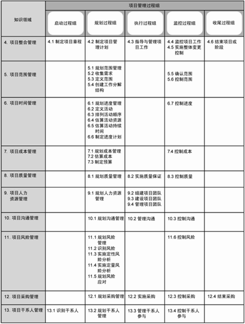

## 第3章项目管理过程

PMBOK®指南从过程间的整合和相互作用，以及各过程的目的等方面，来描述项目管理过程的性质。项目管理过程可归纳为五类，即五大项目管理过程组：

- 启动过程组。定义一个新项目或现有项目的一个新阶段，授权开始该项目或阶段的一组过程。
- 规划过程组。明确项目范围，优化目标，为实现目标制定行动方案的一组过程。
- 执行过程组。完成项目管理计划中确定的工作，以满足项目规范要求的一组过程。
- 监控过程组。跟踪、审查和调整项目进展与绩效，识别必要的计划变更并启动相应变更的一组过程。
- 收尾过程组。完结所有过程组的所有活动，正式结束项目或阶段的一组过程。

### 3.1项目管理过程间的相互作用

在子项目或项目层级上的可交付成果可能被称为增量可交付成果。规划过程组为执行过程组提供项目管理计划和项目文件，而且随项目进展不断更新项目管理计划和项目文件。

### 3.2项目管理过程组

为应对风险事件而采取风险应对措施，就可能引发进一步的分析，从而又会重复执行识别风险过程，并再次开展实施定性风险分析和实施定量风险分析过程，来评估风险影响。

### 3.3启动过程组

一旦项目章程获得批准，项目也就得到了正式授权。

在每个阶段开始时进行启动过程，有助于保证项目符合其预定的业务需要，核实成功标准，审查项目干系人的影响、动力和目标。然后，决定该项目是继续、推迟还是中止。

启动过程也要授权项目经理为开展后续项目活动而动用组织资源。

### 3.4规划过程组

这种项目管理计划的逐渐细化叫做“渐进明细”，表明项目规划和文档编制是反复进行的持续性活动。

在规划项目、制定项目管理计划和项目文件时，项目团队应当征求所有干系人的意见，鼓励所有干系人的参与。

### 3.5执行过程组

执行过程组包含完成项目管理计划中确定的工作，以满足项目规范要求的一组过程。

项目的一大部分预算将花费在执行过程组中。

### 3.6监控过程组

### 3.7收尾过程组

当本过程组完成时，就表明为完成某一项目或项目阶段所需的所有过程组的所有过程均已完成，标志着项目或项目阶段正式结束。

项目或阶段收尾时，可能需要进行以下工作：

- 获得客户或发起人的验收，以正式结束项目或阶段；
- 进行项目后评价或阶段结束评价；
- 记录裁剪任何过程的影响；
- 记录经验教训；
- 对组织过程资产进行适当更新；
- 将所有相关项目文件在项目管理信息系统中归档，以便作为历史数据使用；
- 结束所有采购活动，确保所有相关协议的完结；
- 对团队成员进行评估，释放项目资源。

### 3.8项目信息

需要在项目执行的动态环境中，持续收集和分析项目数据。因此，在实践中，数据和信息这两个术语经常替换使用。但是，随意使用这两个术语，会造成各项目干系人的困惑和误解。以下指南有助于项目团队正确使用术语，并最大限度地减少沟通失误：

- 工作绩效数据。在执行项目工作的过程中，从每个正在执行的活动中收集到的原始观察结果和测量值。例如，工作完成百分比、质量和技术绩效测量值、进度活动的开始和结束日期、变更请求的数量、缺陷数量、实际成本和实际持续时间等。
- 工作绩效信息。从各控制过程中收集并结合相关背景和跨领域关系，进行整合分析而得到的绩效数据。绩效信息的例子有可交付成果的状况、变更请求的执行状况、预测的完工估算。
- 工作绩效报告。为制定决策、提出问题、采取行动或引起关注，而汇编工作绩效信息，所形成的实物或电子项目文件。例如，状况报告、备忘录、论证报告、信息札记、电子报表、推荐意见或情况更新。


**表3-1项目管理过程组与知识领域**

