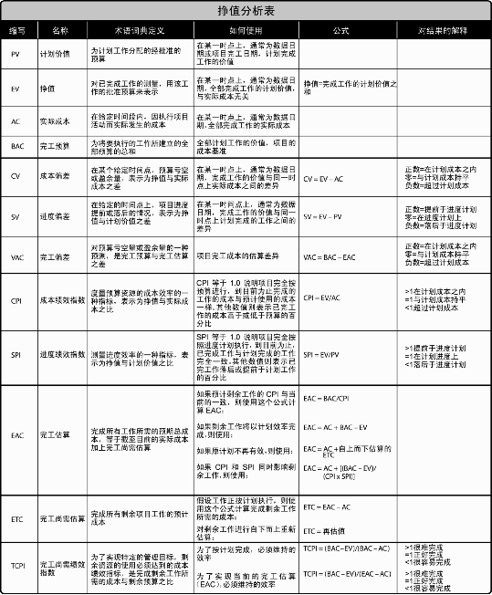

# 第7章项目成本管理

项目成本管理重点关注完成项目活动所需资源的成本，但同时也应考虑项目决策对项目产品、服务或成果的使用成本、维护成本和支持成本的影响。

## 7.1规划成本管理

### 7.1.3规划成本管理：输出
#### 7.1.3.1成本管理计划

 - 组织程序链接。工作分解结构（见5.4节）为成本管理计划提供了框架，以便据此规范地开展成本估算、预算和控制。

## 7.2估算成本

在估算成本时，需要识别和分析可用于启动与完成项目的备选成本方案；需要权衡备选成本方案并考虑风险，如比较自制成本与外购成本、购买成本与租赁成本及多种资源共享方案，以优化项目成本。

在启动阶段可得出项目的粗略量级估算（Rough Order of Magnitude，ROM），其区间为−25%到+75%；之后，随着信息越来越详细，确定性估算的区间可缩小至−5%到+10%。

### 7.2.1估算成本：输入

#### 7.2.1.3范围基准
范围基准包含以下内容：

- 范围说明书。范围说明书（见5.3.3.1节）提供了产品描述、验收标准、主要可交付成果、项目边界及项目的假设条件和制约因素。*在估算项目成本时必须设定的一项基本假设是，估算将仅限于直接成本，还是也包括间接成本。*间接成本是无法直接追溯到某个具体项目的成本，因此只能按某种规定的会计程序进行累计并合理分摊到多个项目中。有限的项目预算是很多项目中最常见的制约因素。其他制约因素包括规定的交付日期、可用的熟练资源和组织政策等。
- 工作分解结构。工作分解结构（见5.4节）指明了项目的全部组件之间及全部可交付成果之间的相互关系。
- WBS词典。WBS词典（见5.4.3.1节）提供了可交付成果的详细信息，并描述了为产出可交付成果，WBS各组件所需进行的工作。
范围基准中可能还包括与合同和法律有关的信息，如健康、安全、安保、绩效、环境、保险、知识产权、执照和许可证等。所有这些信息都应该在进行成本估算时加以考虑。

### 7.2.2估算成本：工具与技术

#### 7.2.2.1专家判断
基于历史信息，专家判断可以对项目环境及以往类似项目的信息提供有价值的见解。专家判断还可以对是否联合使用多种估算方法，以及如何协调方法之间的差异做出决定。

#### 7.2.2.2类比估算
成本类比估算是指以过去类似项目的参数值（如范围、成本、预算和持续时间等）或规模指标（如尺寸、重量和复杂性等）为基础，来估算当前项目的同类参数或指标。在估算成本时，这项技术以过去类似项目的实际成本为依据，来估算当前项目的成本。这是一种粗略的估算方法，有时需要根据项目复杂性方面的已知差异进行调整。
在项目详细信息不足时，例如在项目的早期阶段，就经常使用这种技术来估算成本数值。该方法综合利用历史信息和专家判断。
相对于其他估算技术，类比估算通常成本较低、耗时较少，但准确性也较低。可以针对整个项目或项目中的某个部分，进行类比估算。类比估算可以与其他估算方法联合使用。如果以往项目是本质上而不只是表面上类似，并且从事估算的项目团队成员具备必要的专业知识，那么类比估算就最为可靠。

#### 7.2.2.3参数估算
参数估算是指利用历史数据之间的统计关系和其他变量（如建筑施工中的平方英尺），来进行项目工作的成本估算。参数估算的准确性取决于参数模型的成熟度和基础数据的可靠性。参数估算可以针对整个项目或项目中的某个部分，并可与其他估算方法联合使用。

#### 7.2.2.4自下而上估算
自下而上估算是对工作组成部分进行估算的一种方法。首先对单个工作包或活动的成本进行最具体、细致的估算；然后把这些细节性成本向上汇总或“滚动”到更高层次，用于后续报告和跟踪。自下而上估算的准确性及其本身所需的成本，通常取决于单个活动或工作包的规模和复杂程度。

#### 7.2.2.5三点估算
通过考虑估算中的不确定性与风险，使用三种估算值来界定活动成本的近似区间，可以提高活动成本估算的准确性：

- 最可能成本（cM）。对所需进行的工作和相关费用进行比较现实的估算，所得到的活动成本。
- 最乐观成本（cO）。基于活动的最好情况，所得到的活动成本。
- 最悲观成本（cP）。基于活动的最差情况，所得到的活动成本。
基于活动成本在三种估算值区间内的假定分布情况，使用公式来计算预期成本（cE）。基于三角分布和贝塔分布的两个常用公式如下：
- 三角分布cE= (cO + cM + cP) / 3
- 贝塔分布cE = (cO + 4cM + cP) / 6
基于三点的假定分布计算出期望成本，并说明期望成本的不确定区间。

#### 7.2.2.6储备分析
为应对成本的不确定性，成本估算中可以包括应急储备（有时称为“应急费用”）。应急储备是包含在成本基准内的一部分预算，用来应对已经接受的已识别风险，以及已经制定应急或减轻措施的已识别风险。应急储备通常是预算的一部分，用来应对那些会影响项目的“已知—未知”风险。例如，可以预知有些项目可交付成果需要返工，却不知道返工的工作量是多少。可以预留应急储备来应对这些未知数量的返工工作。可以为某个具体活动建立应急储备，也可以为整个项目建立应急储备，还可以同时建立。应急储备可取成本估算值的某一百分比、某个固定值，或者通过定量分析来确定。
随着项目信息越来越明确，可以动用、减少或取消应急储备。应该在成本文件中清楚地列出应急储备。应急储备是成本基准的一部分，也是项目整体资金需求的一部分。
也可以估算项目所需的管理储备。管理储备是为了管理控制的目的而特别留出的项目预算，用来应对项目范围中不可预见的工作。管理储备用来应对会影响项目的“未知—未知”风险。管理储备不包括在成本基准中，但属于项目总预算和资金需求的一部分。当动用管理储备资助不可预见的工作时，就要把动用的管理储备增加到成本基准中，从而导致成本基准变更。

#### 7.2.2.7质量成本（COQ）
在估算活动成本时，可能要用到关于质量成本（见8.1.2.2节）的各种假设。

#### 7.2.2.9卖方投标分析
在成本估算过程中，可能需要根据合格卖方的投标情况，分析项目成本。在用竞争性招标选择卖方的项目中，项目团队需要开展额外的成本估算工作，以便审查各项可交付成果的价格，并计算出组成项目最终总成本的各分项成本。

## 7.3制定预算

制定预算是汇总所有单个活动或工作包的估算成本，建立一个经批准的成本基准的过程。

项目预算包括经批准用于项目的全部资金。成本基准是经过批准且按时间段分配的项目预算，但不包括管理储备。

### 7.3.2制定预算：工具与技术
#### 7.3.2.1成本汇总
先把成本估算汇总到WBS中的工作包，再由工作包汇总至WBS更高层次（如控制账户），最终得出整个项目的总成本。

### 7.3.3 制定预算：输出
#### 7.3.3.1 成本基准
由于成本基准中的成本估算与进度活动直接关联，因此就可按时间段分配成本基准，得到一条S曲线，


**图7-8项目预算的组成**

#### 7.3.3.2项目资金需求

如果有管理储备，则总资金需求等于成本基准加管理储备。在资金需求文件中，也可说明资金来源。

## 7.4控制成本

要更新预算，就需要了解截至目前的实际成本。

有效成本控制的关键在于，对经批准的成本基准及其变更进行管理。

### 7.4.2控制成本：工具与技术
#### 7.4.2.1挣值管理
挣值管理（EVM）是把范围、进度和资源绩效综合起来考虑，以评估项目绩效和进展的方法。它是一种常用的项目绩效测量方法。它把范围基准、成本基准和进度基准整合起来，形成绩效基准，以便项目管理团队评估和测量项目绩效和进展。作为一种项目管理技术，挣值管理要求建立整合基准，用于测量项目期间的绩效。EVM的原理适用于所有行业的所有项目。它针对每个工作包和控制账户，计算并监测以下三个关键指标：

- 计划价值。计划价值（PV）是为计划工作分配的经批准的预算。它是为完成某活动或工作分解结构组件而准备的一份经批准的预算，不包括管理储备。应该把该预算分配至项目生命周期的各个阶段。在某个给定的时间点，计划价值代表着应该已经完成的工作。PV的总和有时被称为绩效测量基准（PMB），项目的总计划价值又被称为完工预算（BAC）。
- 挣值。挣值（EV）是对已完成工作的测量值，用分配给该工作的预算来表示。它是已完成工作的经批准的预算。EV的计算应该与PMB相对应，且所得的EV值不得大于相应组件的PV总预算。EV常用于计算项目的完成百分比。应该为每个WBS组件规定进展测量准则，用于考核正在实施的工作。项目经理既要监测EV的增量，以判断当前的状态，又要监测EV的累计值，以判断长期的绩效趋势。
- 实际成本。实际成本（AC）是在给定时段内，执行某工作而实际发生的成本，是为完成与EV相对应的工作而发生的总成本。AC的计算口径必须与PV和EV的计算口径保持一致（例如，都只计算直接小时数，都只计算直接成本，或都计算包含间接成本在内的全部成本）。AC没有上限，为实现EV所花费的任何成本都要计算进去。
也应该监测实际绩效与基准之间的偏差：
- 进度偏差。进度偏差（SV）是测量进度绩效的一种指标，表示为挣值与计划价值之差。它是指在某个给定的时点，项目提前或落后的进度，等于挣值（EV）减去计划价值（PV）。进度偏差是一种有用的指标，可表明项目进度是落后还是提前于进度基准。由于当项目完工时，全部的计划价值都将实现（即成为挣值），所以进度偏差最终将等于零。最好把进度偏差与关键路径法（CPM）和风险管理一起使用。公式：SV = EV–PV。
- 成本偏差。成本偏差（CV）是在某个给定时点的预算亏空或盈余量，表示为挣值与实际成本之差。它是测量项目成本绩效的一种指标，等于挣值（EV）减去实际成本（AC）。项目结束时的成本偏差，就是完工预算（BAC）与实际成本之间的差值。由于成本偏差指明了实际绩效与成本支出之间的关系，所以非常重要。负的CV一般都是不可挽回的。公式：CV = EV–AC。
还可以把SV和CV转化为效率指标，以便把项目的成本和进度绩效与任何其他项目作比较，或在同一项目组合内的各项目之间作比较。可以通过偏差来确定项目状态。
- 进度绩效指数。进度绩效指数（SPI）是测量进度效率的一种指标，表示为挣值与计划价值之比。它反映了项目团队利用时间的效率。有时与成本绩效指数（CPI）一起使用，以预测最终的完工估算。当SPI小于1.0时，说明已完成的工作量未达到计划要求；当SPI大于1.0时，则说明已完成的工作量超过计划。由于SPI测量的是项目总工作量，所以还需要对关键路径上的绩效进行单独分析，以确认项目是否将比计划完成日期提前或推迟。SPI等于EV与PV的比值。公式：SPI=EV/PV。
- 成本绩效指数。成本绩效指数（CPI）是测量预算资源的成本效率的一种指标，表示为挣值与实际成本之比。它是最关键的EVM指标，用来测量已完成工作的成本效率。当CPI小于1.0时，说明已完成工作的成本超支；当CPI大于1.0时，则说明到目前为止成本有结余。CPI等于EV与AC的比值。该指标对于判断项目状态很有帮助，并可为预测项目成本和进度的最终结果提供依据。公式：CPI=EV/AC。

#### 7.4.2.2预测

预测要根据项目执行过程中所提供的工作绩效数据（见4.3.3.2节）来产生、更新和重新发布。

由项目经理和项目团队手工进行的自下而上汇总方法，就是一种最普通的EAC预测方法。

可以很方便地把项目经理手工估算的EAC与计算得出的一系列EAC作比较，这些计算得出的EAC代表了不同的风险情景。在计算EAC值时，经常会使用累计CPI和累计SPI值。尽管可以用许多方法来计算基于EVM数据的EAC值，但下面只介绍最常用的三种方法：

- 假设将按预算单价完成ETC工作。这种方法承认以实际成本表示的累计实际项目绩效（不论好坏），并预计未来的全部ETC工作都将按预算单价完成。如果目前的实际绩效不好，则只有在进行项目风险分析并取得有力证据后，才能做出“未来绩效将会改进”的假设。公式：EAC = AC +（BAC–EV）。
- 假设以当前CPI完成ETC工作。这种方法假设项目将按截至目前的情况继续进行，即ETC工作将按项目截至目前的累计成本绩效指数（CPI）实施。公式：EAC = BAC/ CPI。
- 假设SPI与CPI将同时影响ETC工作。在这种预测中，需要计算一个由成本绩效指数与进度绩效指数综合决定的效率指标，并假设ETC工作将按该效率指标完成。如果项目进度对ETC有重要影响，这种方法最有效。使用这种方法时，还可以根据项目经理的判断，分别给CPI和SPI赋予不同的权重，如80/20、50/50或其他比率。公式：EAC =AC +［（BAC–EV）/（CPI x SPI）］。

#### 7.4.2.3完工尚需绩效指数（TCPI）

完工尚需绩效指数（TCPI）是一种为了实现特定的管理目标，剩余资源的使用必须达到的成本绩效指标，是完成剩余工作所需的成本与剩余预算之比。TCPI是指为了实现具体的管理目标（如BAC或EAC），剩余工作的实施必须达到的成本绩效指标。如果BAC已明显不再可行，则项目经理应考虑使用EAC进行TCPI计算。经过批准后，就用EAC取代BAC。基于BAC的TCPI公式：TCPI =（BAC–EV）/（BAC–AC）。

#### 7.4.2.4绩效审查

绩效审查的对象包括：成本绩效随时间的变化、进度活动或工作包超出和低于预算的情况，以及完成工作所需的资金估算。如果采用了EVM，则需要进行以下分析：

- 偏差分析。在EVM中，偏差分析用以解释成本偏差（CV = EV–AC）、进度偏差（SV = EV–PV）和完工偏差（VAC = BAC–EAC）的原因、影响和纠正措施。成本和进度偏差是最需要分析的两种偏差。对于不使用挣值管理的项目，可开展类似的偏差分析，通过比较计划活动成本和实际活动成本，来识别成本基准与实际项目绩效之间的差异。可以实施进一步的分析，以判定偏离进度基准的原因和程度，并决定是否需要采取纠正或预防措施。可通过成本绩效测量来评价偏离原始成本基准的程度。项目成本控制的重要工作包括：判定偏离成本基准（见7.3.3.1节）的原因和程度，并决定是否需要采取纠正或预防措施。随着项目工作的逐步完成，偏差的可接受范围（常用百分比表示）将逐步缩小。
- 趋势分析。趋势分析旨在审查项目绩效随时间的变化情况，以判断绩效是正在改善还是正在恶化。图形分析技术有助于了解截至目前的绩效情况，并把发展趋势与未来的绩效目标进行比较，如EAC与BAC、预测完工日期与计划完工日期的比较。
- 挣值绩效。将实际的进度及成本绩效与绩效测量基准进行比较。如果不采用EVM，则需要对比分析已完成工作的实际成本与成本基准，以考察成本绩效。



**表7-1挣值计算汇总表**
 

 