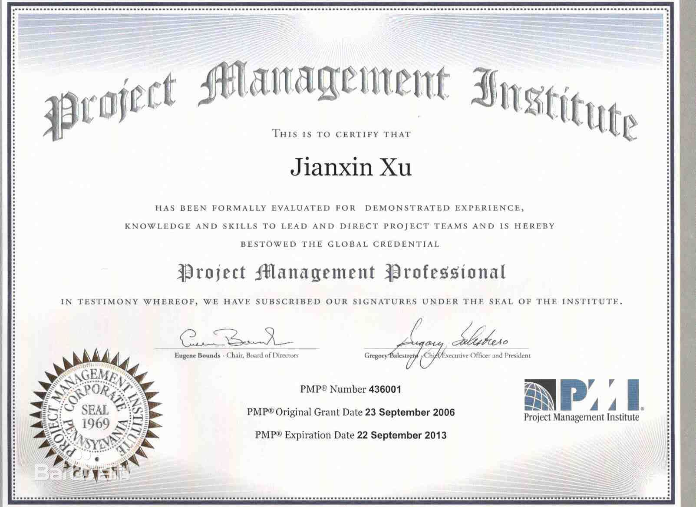

# PMP 学习笔记

##PMP（项目管理专业人士资格认证）

项目管理专业人士资格认证。它是由美国项目管理协会（Project Management Institute(PMI)发起的，严格评估项目管理人员知识技能是否具有高品质的资格认证考试。其目的是为了给项目管理人员提供统一的行业标准。目前，美国项目管理协会建立的认证考试有：PMP（项目管理师）和CAPM（项目管理助理师）已在全世界190多个国家和地区设立了认证考试机构。

### 目录

### 考试内容
PMP考试内容主要包括项目管理五个过程：

启动：确立一个项目或一个项目阶段。

计划：为完成项目，制定和维护一个可操作的计划。

执行：协调人力和其他资源以执行计划。

控制：通过监控和进度测量及必要时采取纠正措施以确保项目目标的实现。

收尾：正式验收项目或项目阶段并使其有条不紊地圆满结束。
### 简介
PMP（Project Management Professional）指项目管理专业人士（人事）资格认证。美国项目管理协会（PMI）举办的项目管理专业人员（PMP）认证考试在全球190多个国家和地区推广，是目前项目管理领域含金量最高的认证。获取PMP证书，不仅提升项目经理的项目管理水平，也直接体现项目经理的个人竞争力，是项目管理专业人士身份的象征。
国内自1999年开始推行PMP认证，由国际监考机构普尔文进行监考及考试组织！
PMP作为项目管理资格认证考试，已在国际上树立了其权威性：

1． PMP为美国培养了一大批项目管理专业人才，项目管理职业已成为美国的“黄金职业”。在中国许多媒体已把PMP称为继MBA，MPA之后的三大金字招牌之一；

2． PMP认证已成为了一个国际性的认证标准，用英语、德语、法语、日语、朝语、西班牙语、葡萄牙语和中文等九种语言进行认证考试；

3． 到目前为止，全球有50多万名PMP，中国大陆地区获得“PMP”头衔的已有7万多人，并逐年增长；

4． 各国纷纷效仿美国的项目管理认证制度，推动了世界项目管理的发展；

要想获得PMP专业认证，考生须达到美国项目管理协会（PMI）规定,对项目管理专业知识的掌握程度及其相应的工作经验和要求；另一方面，获得PMP证书的专业人员应继续从事项目工作，以不断适应项目管理发展的要求！